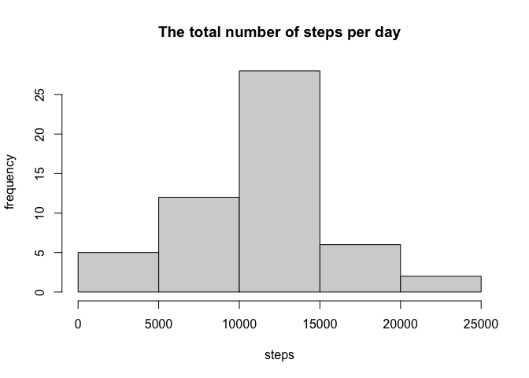
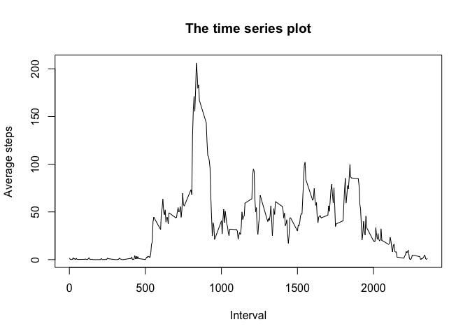
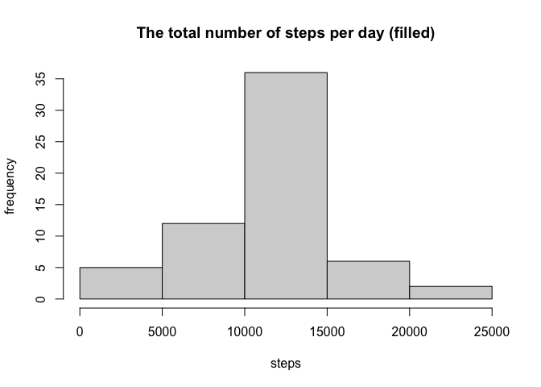
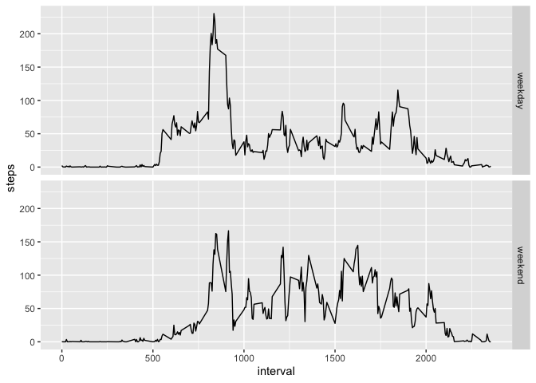

## Loading and preprocessing the data

``` r
### Load data
activity <- read.csv("activity.csv")
filtered_data <- activity[complete.cases(activity),]
head(filtered_data)
```

```
##     steps       date interval
## 289     0 2012-10-02        0
## 290     0 2012-10-02        5
## 291     0 2012-10-02       10
## 292     0 2012-10-02       15
## 293     0 2012-10-02       20
## 294     0 2012-10-02       25
```

``` r
### process date
activity$date <- as.Date(activity$date, format = "%Y-%m-%d")
```

## What is mean total number of steps taken per day?

``` r
### calculate total
total <- aggregate(steps ~ date, filtered_data, sum)
head(total)
```

```
##         date steps
## 1 2012-10-02   126
## 2 2012-10-03 11352
## 3 2012-10-04 12116
## 4 2012-10-05 13294
## 5 2012-10-06 15420
## 6 2012-10-07 11015
```

``` r
### make histogram
hist(x = total$steps,
     main = "The total number of steps per day",
     xlab = "steps",
     ylab = "frequency")
```

<!-- -->

``` r
### calculate mean and median
average <- mean(total$steps)
print(average)
```

```
## [1] 10766.19
```

``` r
med <- median(total$steps)
print(med)
```

```
## [1] 10765
```

## What is the average daily activity pattern?

``` r
### calculate average step
avg_steps <- aggregate(steps ~ interval, filtered_data, mean)

### make time series plot
plot(avg_steps$steps ~ avg_steps$interval, 
     type = "l", 
     ylab = "Average steps", 
     xlab = "Interval",
     main = "The time series plot")
```

<!-- -->

``` r
### find max
interval_max <- which.max(avg_steps$steps)
avg_steps[interval_max,]
```

```
##     interval    steps
## 104      835 206.1698
```

## Imputing missing values

``` r
### calculate NA
sum(is.na(activity))
```

```
## [1] 2304
```

``` r
### input NA and create new dataset
filled_data <- activity
na_sequence <- which(is.na(filled_data$steps))
for (i in na_sequence){
  current_interval <- filled_data$interval[i]
  mean_step <- avg_steps$steps[avg_steps$interval == current_interval]
  filled_data$steps[i] <- mean_step
}

### calculate total and make histogram
new_total <- aggregate(steps ~ date, filled_data, sum)
hist(x = new_total$steps,
     main = "The total number of steps per day (filled)",
     xlab = "steps",
     ylab = "frequency")
```

<!-- -->

``` r
### calculate mean and median
average_filled <- mean(new_total$steps)
print(average_filled)
```

```
## [1] 10766.19
```

``` r
med_filled <- median(new_total$steps)
print(med_filled)
```

```
## [1] 10766.19
```

## Are there differences in activity patterns between weekdays and weekends?

``` r
### distinguish weekday and weekend
filled_data$date_type <- factor(ifelse(weekdays(filled_data$date) %in% c("Saturday", "Sunday"), 
                                        "weekend", "weekday"))
head(filled_data)
```

```
##       steps       date interval date_type
## 1 1.7169811 2012-10-01        0   weekday
## 2 0.3396226 2012-10-01        5   weekday
## 3 0.1320755 2012-10-01       10   weekday
## 4 0.1509434 2012-10-01       15   weekday
## 5 0.0754717 2012-10-01       20   weekday
## 6 2.0943396 2012-10-01       25   weekday
```

``` r
### calculate new average step
new_avg_steps <- aggregate(steps ~ interval + date_type, filled_data, mean)
head(new_avg_steps)
```

```
##   interval date_type      steps
## 1        0   weekday 2.25115304
## 2        5   weekday 0.44528302
## 3       10   weekday 0.17316562
## 4       15   weekday 0.19790356
## 5       20   weekday 0.09895178
## 6       25   weekday 1.59035639
```

``` r
### make new time series plot with ggplot2
library(ggplot2)
figure <- ggplot(new_avg_steps, aes(
  x = interval,
  y = steps)) +
  geom_line() +
  facet_grid(date_type ~.) +
  labs(x = "interval", y = "steps")
print(figure)
```

<!-- -->
